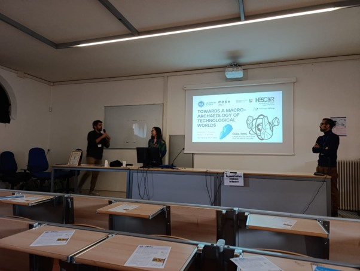
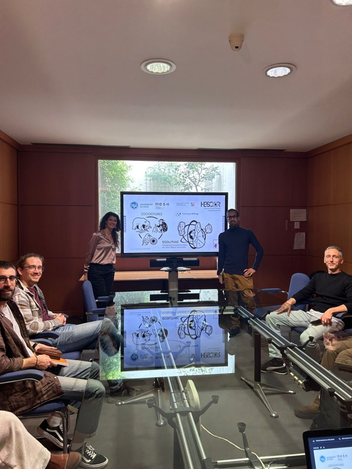
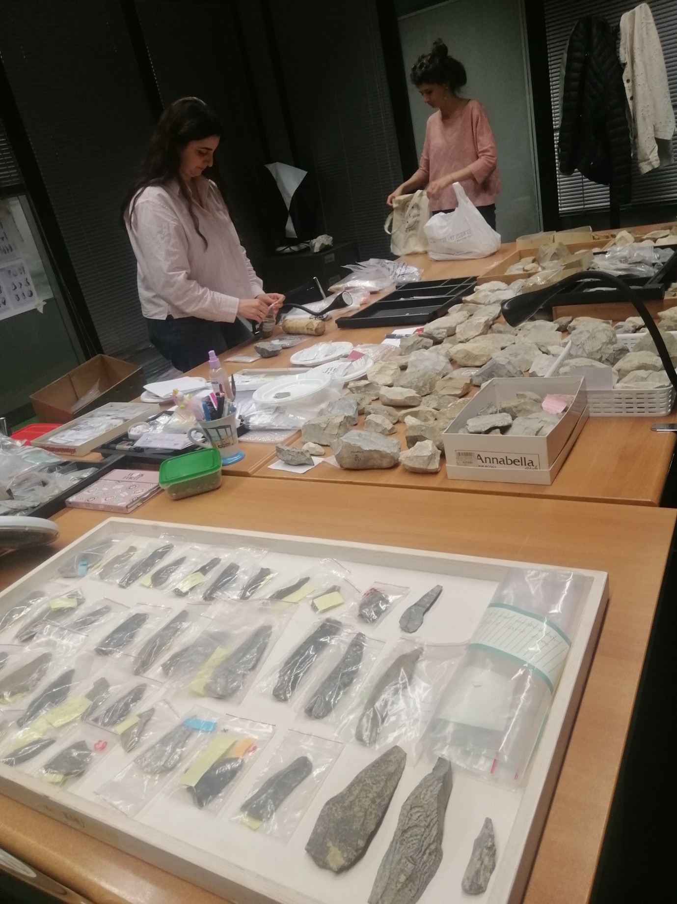
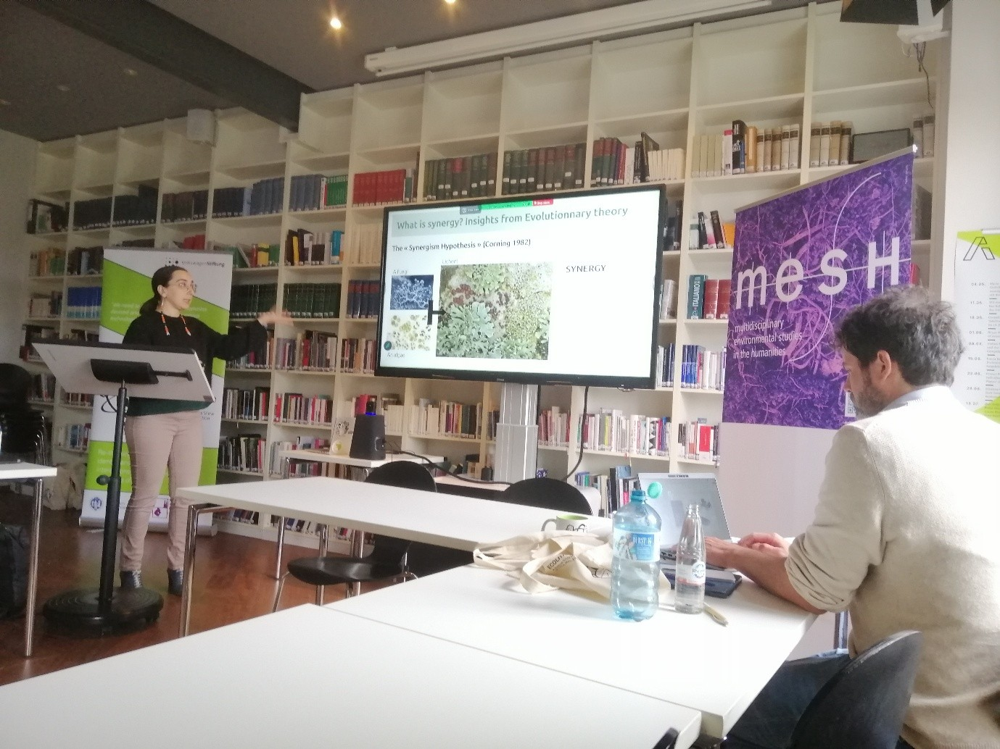
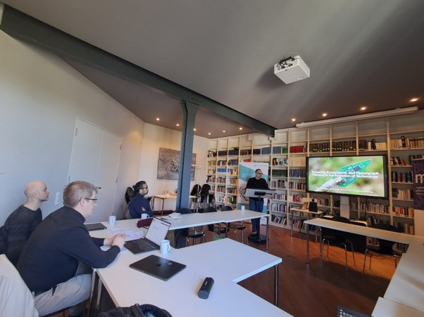

Welcome! This newsletter brings together two projects rethinking the deep-time evolution of human technology. <strong><a href="https://zoogestures.uni-koeln.de/" class="zoogestures-name">ZOOGESTURES</a></strong> explores the overlooked role of nonhuman animal gestures in inspiring and scaffolding technical learning and innovation in early human evolution. <strong><a href="https://ecolithic.uni-koeln.de/" class="ecolithic-name">ECOLITHIC</a></strong> develops a radical new ecosystems view of long-term Palaeolithic stone tool evolution. Together, they open up fresh perspectives on how humans became technological beings – never alone, but always in relation to their wider world!

 

# ECOLITHIC: A Radical Ecosystems View of Lithic Macro-Evolution

## Happenings

### **Anaïs L. Vignoles joins ECOLITHIC** (January 1)

Anaïs L. Vignoles joins the University of Cologne and the ECOLITHIC project as a post-doctoral researcher, supporting the team for the next 2 years. She is a prehistoric archaeologist interested in lithic technological evolution, the dynamic interaction of material culture and climate on evolutionary time scales, and the relationship between ecological and technological diversity. In the project, she explores how technical systems coexist in the Late Middle and Upper Palaeolithic of southwestern France, with a focus on Gravettian blade and bladelet technology.

[add photo]

### **ECOLITHIC launch event at the Department for Prehistoric Archaeology** (January 9)

We successfully launched the project and welcomed new ECOLITHIC post-doctoral researcher Anaïs L. Vignoles in Cologne. Shumon T. Hussain presented an overview of the work programme and shared some initial project ideas to be developed and tested in the next 3 years. The launch was followed by a cosy get-together with drinks and lively discussions into the late evening.

[add photo]

### **Igor Djakovic visits the ECOLITHIC team in Cologne** (March 9–10)

PhD researcher Igor Djakovic from the Human Origins group of the Faculty of Archaeology at Leiden University, the Netherlands, visited us for two days, presenting ongoing work on the Late Middle Palaeolithic sequence of Le Moustier and discussing all matters lithic technology and technological coexistence.

### **ECOLITHIC presents first ideas at the 67th Annual Meeting of the Hugo-Obermaier Society in Ferrara, Italy** (April 7–11)

Shumon T. Hussain and Anaïs L. Vignoles gave their first joint presentation of the ECOLITHIC project and its objectives at the 67th Annual Meeting of the [Hugo-Obermaier Society in Ferrara, Italy](https://obermaier-gesellschaft.de/uncategorized/67-jahrestreffen-7-11-april-2026-in-ferrara-italien/). They spent a lovely week listening to interesting presentations, networking, as well as eating pasta and ice-cream. The conference concluded with a field trip to the iconic Middle and Early Upper Palaeolithic site of Fumane and a group visit of the National Archaeological Museum of Verona.

### **Visit in Ravenna to explore international collaborations** (April 12–17)

Shumon T. Hussain spent a week at the Department of Cultural Heritage of the University of Bologna campus in Ravenna to work with Giulia Marciani (Bologna) and Serena Lombardo (Tübingen) on questions of bipolar technology and technological coexistence in the lithic bipolar milieu during the Upper Palaeolithic. Shumon also presented ongoing research in the ECOLITHIC project.

### **First ECOLITHIC Workshop in Cologne** (April 21–23)

Anaïs L. Vignoles and Shumon T. Hussain hosted a 4-day international workshop with the external project collaborators to discuss interdisciplinary perspectives on long-term macroevolution and to develop a new research framework for studying it in and testing it against the Pleistocene archaeological record. Using the facilities of MESH and the Department for Prehistoric Archaeology, we discussed higher-level system properties (Hussain), synergy (Vignoles), hierarchical organization (Temkin), scaling and scale-dependency (Spiridonov), collaborative decision-making (Barfuss), invention and evolvability (Charbonneau), relational network thinking including hypergraphs (Valverde), and technological enactivism (Feiten).

### **Visit to the TRACES lab in Toulouse** (May 7)

Anaïs L. Vignoles was invited to give a presentation on her ongoing work at the TRACES lab’s SMP3C (*Sociétés et milieux des populations de chasseurs-cueilleurs-collecteurs*) team meeting. It was a good occasion to present some of the objectives of the project as well as initial ideas and results of the team’s work.

### **Sébastien Plutniak visits the ECOLITHIC team in Cologne** (June 29–30)

Senior CNRS researcher Sébastien Plutniak from the CITERES-LAT laboratory in Tours, France, visited us for two days to discuss computational archaeology and open science. He also presented some aspects of his ongoing work on digital epistemologies and refitting in the recurring meeting series of the Palaeolithic Research Unit (FAST) at the Department of Prehistoric Archaeology (title of the talk: “On Archaeological Uncertainty. Or Why and How Refitting Analysis Matters”).

[add photo if you have one]

### **ECOLITHIC at the 16th Annual Meeting of the European Society for the Study of Human Evolution [(ESHE)](https://www.eshe.eu/meetings/) in Burgos, Spain** (September 17–19)

Shumon T. Hussain presented a poster outlining the project’s newly developed multi-level research framework for the study of lithic macroevolution, anchored in the idea of a “holarchy” of technological organization.

[add photo]

## Announcements

### **ECOLITHIC at the HESCOR Virtual Exhibition** (October 23)

ECOLITHIC will be present at the hybrid Vernissage of the [HESCOR]((https://www.hescor-project.com/)) Virtual Exhibition on October 23, hosting its own virtual room and showcasing some key ideas and initial results of the project. The HESCOR Virtual Exhibition aims to present research conducted during the University of Cologne’s 3-year, cross-faculty research initiative HESCOR (*Human & Earth System Coupled Research*) to a broader audience. HESCOR has brought into dialogue Earth system science and the humanities to better understand and integrate human agency into Earth system modelling.

## Meeting the Team

### **[Name of Person in Video]**

[Add link or information on the video interviews].

## Publications

### New 

- **Hussain, S.T.** (2024). ‘Transformation analysis and systems-theory: from micro-scale lithic technical systems to macro-scale lithic ecosystems.’ In: Th. Uthmeier and A. Maier (eds.), *Studying Technologies of Non-Analogous Environments and Glacial Ecosystems. Papers in Honor of Jürgen Richter*, pp. 531–547. Bonn: Habelt.

- **Hussain, S.T.** (2025). ‘“Intentions do not fossilize” – Unpacking problematic domain-assumptions in Pleistocene lithic studies.’ In: Hussain, S.T. and G.L. Dusseldorp (eds.), *“Sitting on the fence”: Negotiating archaeology, anthropology, and philosophy. Festschrift for Prof. Dr Raymond H.A. Corbey in celebration of his 70th birthday*, pp. 103–114. Leiden: Sidestone Press. [https://www.sidestone.com/books/sitting-on-the-fence](https://www.sidestone.com/books/sitting-on-the-fence)

- Vaesen, K., and **S.T. Hussain** (2026). ‘The Perks and Perils of Replicability’. *American Antiquity* 91: 437–444. [https://doi.org/10.1017/aaq.2025.10146](https://doi.org/10.1017/aaq.2025.10146)

- **Hussain, S.T.** (2026). ‘Replication as Salvation: The Politics of Open Science and the Recurring Allure of Scientism in Deep-Time Lithic Studies’. *Journal of Paleolithic Archaeology* 9: 15. [https://doi.org/10.1007/s41982-026-00261-6](https://doi.org/10.1007/s41982-026-00261-6)

### Forthcoming/Submitted 

- **Hussain, S.T.** (submitted). ‘Holotechnologies: Trading Theory for A New Macroarchaeology of Large-Scale Technological Structures.’ *Ethnographisch-Archäologische Zeitschrift* (EAZ).

- **Hussain, S.T.**, **A.L. Vignoles**, M. Charbonneau, T.E. Feiten, A. Spiridonov, I. Tëmkin, and S. Valverde (submitted). ‘Technospheric Dynamics in the Deep Human Past: Multi-Level Causation in the Macroevolution of Late Pleistocene Lithic Technology.’ *Journal of Quaternary Science*.

- **Hussain, S.T.**, Ohrem, O., Bartosch, R., Schwegler, C., Stutz, A.J., Simon, Z.B., and Rigby, K. (submitted). ‘Earth System Agency and Telecausality: Bringing the Earth Sciences and the Environmental Humanities into Conversation.’ *Journal of Quaternary Science*.

- Vidiella, B., G. Nicoletti, R. Fernández, A. Spiridonov, A. Sanchez, **S.T. Hussain**, and S. Valverde (submitted). ‘Higher-order assembly and emergent persistence in biology.’ *Current Opinion in Systems Biology*.

- Plutniak, S., **S.T. Hussain**, and F. Riede (forthcoming fall 2026). *Between variability and singularity: crossing theoretical, qualitative and computer-based approaches to types and typologies in archaeology*. Leiden: Sidestone Press. [https://www.sidestone.com/books/between-variability-and-singularity](https://www.sidestone.com/books/between-variability-and-singularity)

- Plutniak, S., **S.T. Hussain**, and F. Riede (forthcoming fall 2026). ‘Typologising archaeological typologies: Motivation, structure and the making of a digitally augmented edited volume.’ In: S. Plutniak, S.T. Hussain, and F. Riede (eds.), *Between variability and singularity: crossing theoretical, qualitative and computer-based approaches to types and typologies in archaeology*, pp. 7–20. Leiden: Sidestone Press. [https://www.sidestone.com/books/between-variability-and-singularity](https://www.sidestone.com/books/between-variability-and-singularity)

- **Hussain, S.T.** (forthcoming fall 2026). ‘The Loss of Typological Innocence: Pluralism in the Epistemology and Ontology of Archaeological Typo-Praxis’. In: Plutniak, S., Hussain, S.T. and Riede, F. (eds.), *Between variability and singularity: crossing theoretical, qualitative and computer-based approaches to types and typologies in archaeology*, pp. 65–104. Leiden: Sidestone Press. [https://www.sidestone.com/books/between-variability-and-singularity](https://www.sidestone.com/books/between-variability-and-singularity)

- **Hussain, S.T.** (forthcoming fall 2026). ‘Do we need (more) humble typologies?’ In: S. Plutniak, S.T. Hussain, and F. Riede (eds.), *Between variability and singularity: crossing theoretical, qualitative and computer-based approaches to types and typologies in archaeology*, pp. 257–268. Leiden: Sidestone Press. [https://www.sidestone.com/books/between-variability-and-singularity](https://www.sidestone.com/books/between-variability-and-singularity)

## Ongoing Work

- The ECOLITHIC team is working on a joint paper on the configuration of lithic ecosystems involving bipolar reduction technology during the Upper Palaeolithic in Mediterranean Europe, in collaboration with Giulia Marciani and Serena Lombardo.

- Sergi Valverde (Barcelona) and Shumon T. Hussain are working on a joint paper examining the nonlinear, multi-level dynamics of multi-domain lithic technological change in the Final Palaeolithic of Europe.

- The ECOLITHIC team is developing a regional macro-archaeological database of technical systems’ co-occurrence during the critical time frame of the Late Middle Palaeolithic and Upper Palaeolithic in southwestern France. Two online mini-workshops were so far organized on May 13 and September 9 to discuss the approach and data framework with French colleagues. The team is currently preparing a larger 3-day in-person workshop at Les Eyzies in the Dordogne region to discuss things further with experts on the lithic record of the area.

# ZOOGESTURES - Interspecies Learning and Technical Invention in Early Human Evolution

## Happenings

### **Matt Henderson joins ZOOGESTURES** (March 1)

[Matt]

### **Rebekka I.I. Eckelmann joins ZOOGESTURES** (June 1)

[Rebekka joins ZOOGESTURES](https://zoogestures.uni-koeln.de/people/rebekka-ii-eckelmann) as a postdoctoral researcher and multispecies archaeologist, with a background in faunal osteology and isotope biogeochemistry. Her research explores how human–nonhuman relationships shaped past subsistence, social organisation and technological practices. Within ZOOGESTURES, she brings an archaeological perspective to past socio-zoo-technical relations.

### **Welcome to the team, Rebekka and Matt!**

### **ZOOGESTURES kicks off with a Bang – Launch at the Department for Prehistoric Archaeology (Cologne) attracts diverse audience** (July 15)

On 15 July, ZOOGESTURES celebrated its official launch, with Multispecies Archaeology (Cologne) now active as the last of the three work packages, following the start of work in Philosophy of Technology (Siegen) and Primatology (St Andrews) earlier this year. The Kick-Start Event brought together more than 20 participants from Prehistoric Archaeology, MESH, Philosophy, African Studies and beyond for an afternoon of presentations, discussion and exchange.

Following an introduction to the project by Shumon T. Hussain and Rebekka I.I. Eckelmann, the programme continued with contributions from Thomas Widlok, who explored the distinction between technique as transfer and technique as culture, and Johannes Schick, who spoke on containers, media and multispecies technology in early evolution. We were particularly pleased to welcome external speakers Sonja Tomasso (Liege), who offered a functional-analytical perspective on animal materials in stone-tool technology, and Bar Efrati (Oxford), with a theoretical exploration of the “multispecies chaîne opératoire”.

What really stood out was the lively discussion in between, full of probing questions and unexpected connections. ZOOGESTURES’ core idea – that human technology has never been a purely human affair – clearly resonated beyond our own disciplinary boundaries, opening up possibilities for new collaborations.

### **Scoping Workshop for Multispecies Archaeology funded** (August 25)

The [VolkswagenFoundation](https://www.volkswagenstiftung.de/en/funding/funding-offer/scoping-workshops) will fund a 3-day scoping workshop on the state-of-the-art and future of multispecies archaeology with 42,000 Euros. The workshop will be co-organized by Shumon Hussain (Cologne), Nathalie Brusgaard (Leiden), Hannah Chazin (New York) and Henny Piezonka (Berlin), host 27 participants from around the world, and take place at beautiful castle Herrenhausen in Hannover from 6-8 October 2027.

## Announcements

### **Multispecies Session at [Kiel Conference](https://www.uni-kiel.de/de/cluster-roots/kiel-conference)** (March 8-12)

ZOOGESTURES is organising “Session 3: Multispecies Ecologies of Innovation” at the Kiel Conference in the coming spring. It will focus on innovation as a multispecies project and human-animal learning in the widest sense with more information found in the [abstract](https://www.uni-kiel.de/fileadmin/user_upload/cluster/roots/Kiel_Conference/Call_for_Papers/2027_KielConference_Call_for_Papers_Session_03.pdf). We hope to see some of you in Kiel!

Deadline: 15th of October

## Meeting the Team

### Today: [Johannes Schick](https://zoogestures.uni-koeln.de/people/johannes-f-m-schick) [Photo? One from the inauguration speech would be nice]

**1. What is your role in ZOOGESTURES, and how does it connect to the project's major objectives?**

**2. How does your past or ongoing research feed into the project and shape its interdisciplinary perspective**

**3. What are you working on at the moment, and what is especially exciting about it?**

**4. What's one surprising insight you've had while working on this research?**

[Please add answers of max. 2-3 sentences per question – you are free to modify the questions as well if you think it necessary.]

**Johannes Schick delivered his habilitation lecture “„Wir hätten nur noch einen Technologen gebraucht, um vollständig zu sein“ (Marcel Mauss) – Über den Versuch einer interdisziplinären Technikanthropologie“ [„"All we needed was a technologist to be complete" (Marcel Mauss) - On the attempt to develop an interdisciplinary anthropology of technology] on the 1st of June.**

**Many congratulations from the team!**

## Publications

### New

- **Hussain, S. T.**, and D. Ohrem (2026). ‘Learning Environments with Other Animals.’ *Humanimalia* 16 (2): 251–295. ([https://doi.org/10.52537/humanimalia.23616](https://doi.org/10.52537/humanimalia.23616))

- **Hussain, S.T.** (2026). ‘Animals and Humans in the Paleolithic’. In: A. Mertig (ed.), *Research Handbook on Animals and Society*, pp. 66–89. Cheltenham: Edward Elgar Publishing. ([https://www.elgaronline.com/edcollbook/book/9781035300099/9781035300099.xml](https://www.elgaronline.com/edcollbook/book/9781035300099/9781035300099.xml))

[Add any if relevant, starting in Jan 2026]

### Forthcoming/Submitted 

- **Hussain, S.T.** and T. Breyer (forthcoming fall 2026). *Re-Calibrating Phenomenological Archaeology: More-than-human Lifeworlds*. Cambridge University Press, Elements in 21st Century Anthropological Archaeology.

- **Hussain, S.T.**, and D. Ohrem (forthcoming 2027). ‘Beyond the Mangle of Culture: Lifeforms as Units of More-Than-Human Interdisciplinary History.’ In: H. Feder, S. McFahrland (eds.), *The Critical Question of Animal Cultures*. Routledge. (Zenodo Preprint: [https://doi.org/10.5281/zenodo.17113299](https://doi.org/10.5281/zenodo.17113299))

- **Hussain, S.T.** (submitted). ‘Multispecies vulnerability, resilience, and sustainability: Re-storying catastrophic archaeological pasts.’ *Humanimalia*.

- De Carvalho Cabral, D., and **S.T. Hussain** (submitted). *Inventing Brazil’s Saúvas: Eventful Megahistories of Human-Ant Coexistence in Greater Amazonia*. Cambridge University Press, Elements in Environmental Humanities.

[Add any relevant publications submitted since January 2026]

## Ongoing Work

- The ZOOGESTURES team is currently planning the 1st project workshop to be held in Cologne in November 2026 and its joint primatological-anthropological fieldwork programme, starting in 2027.

- [Matt + Cat]

- Rebekka is exploring how animals could have shaped technological learning, beginning with enigmatic marine animals as a first area of investigation. Alongside this, she and colleagues are working with the role of hares and multispecies learning in two Neolithic contexts.

- [Johannes]

- [add other relevant stuff, etc.]

# PHOTO GALLERY

 

<em>Johannes doing spontaneous fieldwork on multispecies encounters during his vacation.</em>

