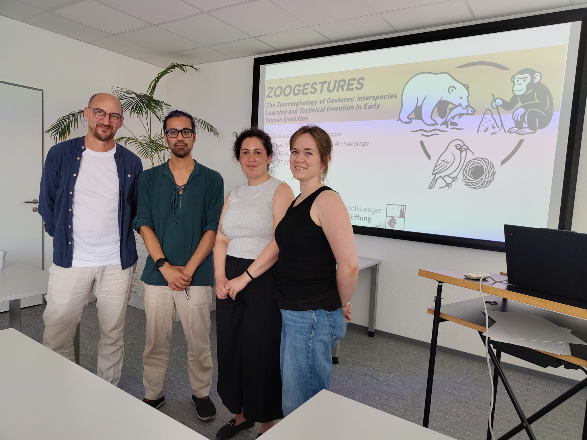
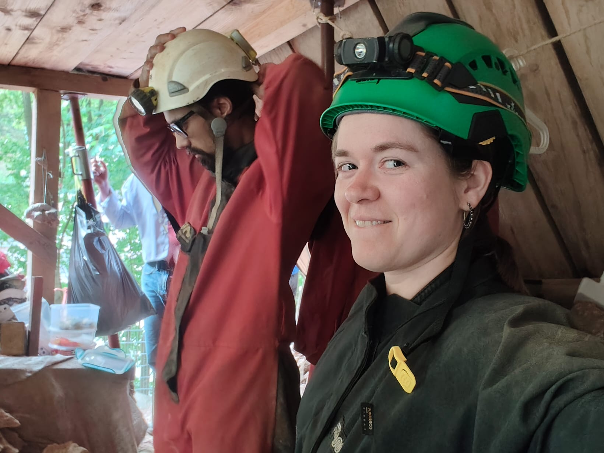
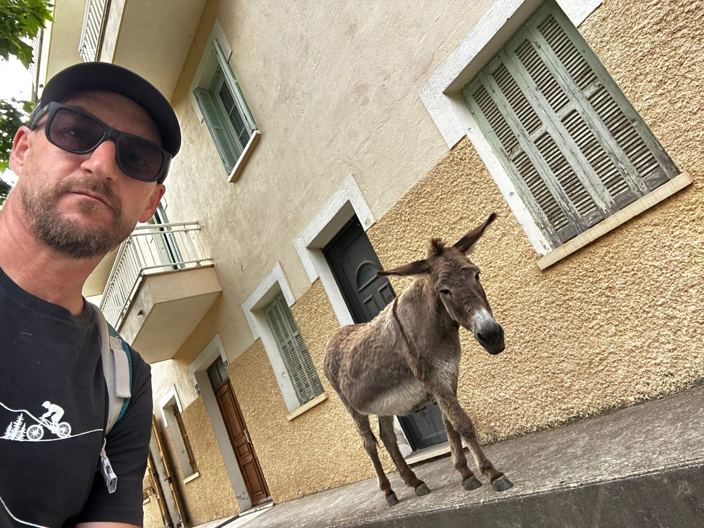

# ECOLITHIC: A radical jkdhfdfg

## ECOLITHIC workshop

### 

hello we had fun!

## Welcoming Rebekka in ZOOGESTURES!

qsfhgqsjdklùfgq

# Stones & Animals Newsletter

# ZOOGESTURES

## Happenings

### **Matt Henderson joins ZOOGESTURES** (March 1)

[Matt]

### **Rebekka I.I. Eckelmann joins ZOOGESTURES** (June 1)

[Rebekka joins ZOOGESTURES](https://zoogestures.uni-koeln.de/people/rebekka-ii-eckelmann) as a postdoctoral researcher and multispecies archaeologist, with a background in faunal osteology and isotope biogeochemistry. Her research explores how human–nonhuman relationships shaped past subsistence, social organisation and technological practices. Within ZOOGESTURES, she brings an archaeological perspective to past socio-zoo-technical relations.

### **Welcome to the team, Rebekka and Matt!**

### **ZOOGESTURES kicks off with a Bang – Launch at the Department for Prehistoric Archaeology (Cologne) attracts diverse audience** (July 15)

On 15 July, ZOOGESTURES celebrated its official launch, with Multispecies Archaeology (Cologne) now active as the last of the three work packages, following the start of work in Philosophy of Technology (Siegen) and Primatology (St Andrews) earlier this year. The Kick-Start Event brought together more than 20 participants from Prehistoric Archaeology, MESH, Philosophy, African Studies and beyond for an afternoon of presentations, discussion and exchange.

Following an introduction to the project by Shumon T. Hussain and Rebekka I.I. Eckelmann, the programme continued with contributions from Thomas Widlok, who explored the distinction between technique as transfer and technique as culture, and Johannes Schick, who spoke on containers, media and multispecies technology in early evolution. We were particularly pleased to welcome external speakers Sonja Tomasso (Liege), who offered a functional-analytical perspective on animal materials in stone-tool technology, and Bar Efrati (Oxford), with a theoretical exploration of the “multispecies chaîne opératoire”.

What really stood out was the lively discussion in between, full of probing questions and unexpected connections. ZOOGESTURES’ core idea – that human technology has never been a purely human affair – clearly resonated beyond our own disciplinary boundaries, opening up possibilities for new collaborations.

### **Scoping Workshop for Multispecies Archaeology funded** (August 25)

The [VolkswagenFoundation](https://www.volkswagenstiftung.de/en/funding/funding-offer/scoping-workshops) will fund a 3-day scoping workshop on the state-of-the-art and future of multispecies archaeology with 42,000 Euros. The workshop will be co-organized by Shumon Hussain (Cologne), Nathalie Brusgaard (Leiden), Hannah Chazin (New York) and Henny Piezonka (Berlin), host 27 participants from around the world, and take place at beautiful castle Herrenhausen in Hannover from 6-8 October 2027.

## Announcements

### **Multispecies Session at [Kiel Conference](https://www.uni-kiel.de/de/cluster-roots/kiel-conference)** (March 8-12)

ZOOGESTURES is organising “Session 3: Multispecies Ecologies of Innovation” at the Kiel Conference in the coming spring. It will focus on innovation as a multispecies project and human-animal learning in the widest sense with more information found in the [abstract](https://www.uni-kiel.de/fileadmin/user_upload/cluster/roots/Kiel_Conference/Call_for_Papers/2027_KielConference_Call_for_Papers_Session_03.pdf). We hope to see some of you in Kiel!

Deadline: 15th of October

## Meeting the Team

### Today: [Johannes Schick](https://zoogestures.uni-koeln.de/people/johannes-f-m-schick) [Photo? One from the inauguration speech would be nice]

**1. What is your role in ZOOGESTURES, and how does it connect to the project's major objectives?**

**2. How does your past or ongoing research feed into the project and shape its interdisciplinary perspective**

**3. What are you working on at the moment, and what is especially exciting about it?**

**4. What's one surprising insight you've had while working on this research?**

[Please add answers of max. 2-3 sentences per question – you are free to modify the questions as well if you think it necessary.]

**Johannes Schick delivered his habilitation lecture “„Wir hätten nur noch einen Technologen gebraucht, um vollständig zu sein“ (Marcel Mauss) – Über den Versuch einer interdisziplinären Technikanthropologie“ [„"All we needed was a technologist to be complete" (Marcel Mauss) - On the attempt to develop an interdisciplinary anthropology of technology] on the 1st of June.**

**Many congratulations from the team!**

## New Publications

- **Hussain, S. T.**, and D. Ohrem (2026). ‘Learning Environments with Other Animals.’ *Humanimalia* 16 (2): 251–295. ([https://doi.org/10.52537/humanimalia.23616](https://doi.org/10.52537/humanimalia.23616))

- **Hussain, S.T.** (2026). ‘Animals and Humans in the Paleolithic’. In: A. Mertig (ed.), *Research Handbook on Animals and Society*, pp. 66–89. Cheltenham: Edward Elgar Publishing. ([https://www.elgaronline.com/edcollbook/book/9781035300099/9781035300099.xml](https://www.elgaronline.com/edcollbook/book/9781035300099/9781035300099.xml))

[Add any if relevant, starting in Jan 2026]

## Forthcoming/Submitted Publications

- **Hussain, S.T.** and T. Breyer (forthcoming fall 2026). *Re-Calibrating Phenomenological Archaeology: More-than-human Lifeworlds*. Cambridge University Press, Elements in 21st Century Anthropological Archaeology.

- **Hussain, S.T.**, and D. Ohrem (forthcoming 2027). ‘Beyond the Mangle of Culture: Lifeforms as Units of More-Than-Human Interdisciplinary History.’ In: H. Feder, S. McFahrland (eds.), *The Critical Question of Animal Cultures*. Routledge. (Zenodo Preprint: [https://doi.org/10.5281/zenodo.17113299](https://doi.org/10.5281/zenodo.17113299))

- **Hussain, S.T.** (submitted). ‘Multispecies vulnerability, resilience, and sustainability: Re-storying catastrophic archaeological pasts.’ *Humanimalia*.

- De Carvalho Cabral, D., and **S.T. Hussain** (submitted). *Inventing Brazil’s Saúvas: Eventful Megahistories of Human-Ant Coexistence in Greater Amazonia*. Cambridge University Press, Elements in Environmental Humanities.

[Add any if relevant, starting what has been submitted in Jan 26]

## Ongoing Work

- The ZOOGESTURES team is currently planning the 1st project workshop to be held in Cologne in November 2026 and its joint primatological-anthropological fieldwork programme, starting in 2027.

- [Matt + Cat]

- Rebekka is exploring how animals could have shaped technological learning, beginning with enigmatic marine animals as a first area of investigation. Alongside this, she and colleagues are working with the role of hares and multispecies learning in two Neolithic contexts.

- [Johannes]

- [add other relevant stuff, etc.]

## Photo Gallery

